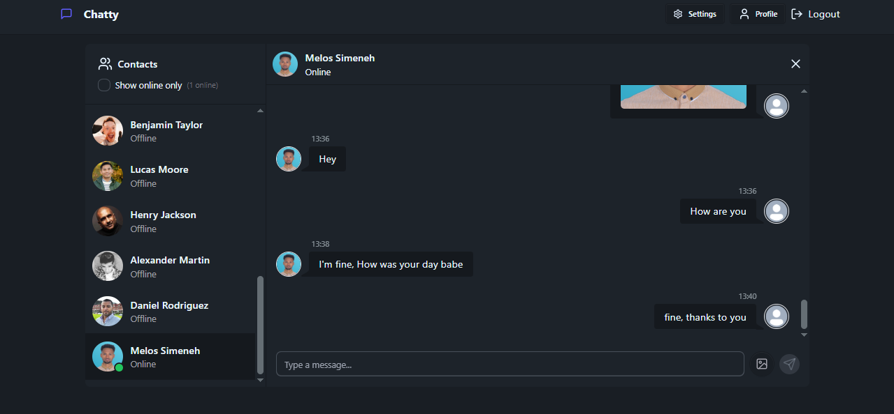
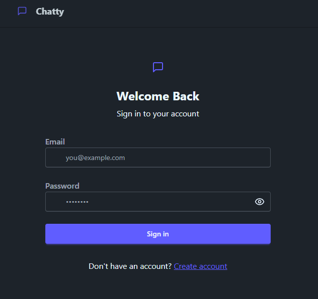
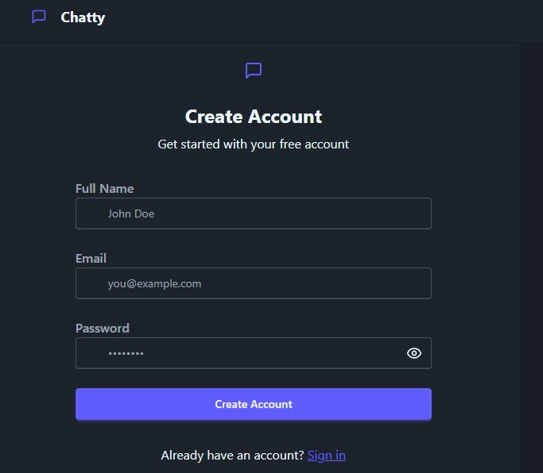

# 💬 Real-Time Chat App

A full-stack real-time chat application built using **React**, **Node.js**, **Express**, **Socket.io**, and **MongoDB**. Users can register, log in, and chat in real-time.

## 🚀 Live Demo

Check out the deployed app here: [https://realtime-chat-app-df1a.onrender.com/](https://realtime-chat-app-df1a.onrender.com/)

## 📸 Screenshots

**🖥️ Chat Interface**  


**🔐 Login Page**  


**📝 Register**  


## 🚀 Features

- 🔒 User Authentication (Register & Login)

- 💬 Real-time messaging using Socket.IO

- 📦 Persistent chat history stored in MongoDB

- 🟢 Online/offline user status

- 🌐 Responsive UI with React

## 🛠️ Tech Stack

- **Frontend**: React, Socket.IO Client

- **Backend**: Node.js, Express, Socket.IO

- **Database**: MongoDB

- **Authentication**: JWT, bcrypt

## 📁 Project Structure

```bash
realtime-chat-app/
├── backend/       # Express + Socket.IO + MongoDB
├── frontend/      # React app
├── package.json   # Root scripts for build/start
```

## ⚙️ Installation

### 1. Clone the Repository

```bash
git clone https://github.com/melos-simeneh/realtime-chat-app.git
cd realtime-chat-app
```

### 2. Backend Setup

```bash
cd server
npm install
```

Create a .env file inside the server directory:

```ini
NODE_ENV=development #for production set it to production
PORT=5000
MONGO_URI=your_mongodb_connection_string
JWT_SECRET=your_jwt_secret
```

Start the backend server:

```bash
npm run dev
```

The backend server  will be available at [http://localhost:5000](http://localhost:5000)

### 3. Frontend Setup

```bash
cd ../frontend
npm install
```

Start the React app:

```bash
npm run dev
```

The app will be available at [http://localhost:5173](http://localhost:5173)

**⚙️ Other way to run the app**
Local Development

```bash
# Install dependencies and start both frontend and backend
npm install
npm run start
```

This will start the backend server using the backend/start script.

Build for Production

```bash
npm run build
```

This installs all dependencies in both frontend and backend and builds the React app.

## 🔌 How it Works

- When a user logs in, a Socket.IO connection is established.

- Messages are sent and received in real-time using WebSockets.

- Chat history is saved in MongoDB and fetched on load.

- User sessions are managed with JWT tokens.
